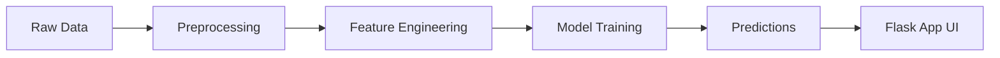

Here’s a more **interactive, modern, and engaging README** you can drop into your repo. I’ve kept your content but upgraded tone, flow, and added badges, visuals, and user-focused sections 👇

---

# 🚀 **Sales Forecasting for Rossmann Pharmaceuticals**

> 📊 Predict store sales **up to 6 weeks ahead** using machine learning
> ⚡ Built for smarter decisions, better inventory, and scalable insights

---

## ✨ **Why This Project Matters**

Imagine running hundreds of pharmacy stores and guessing future sales 😬
That’s exactly the challenge **Rossmann Pharmaceuticals** faced.

This project replaces intuition with **data-driven forecasting**, helping:

* 📦 Optimize inventory
* 👩‍💼 Empower store managers
* 📉 Reduce losses from over/under-stocking
* 📊 Improve long-term planning

---

## 🧠 **What Makes It Powerful**

This model doesn’t just look at past sales—it understands **real-world factors**:

| 🔍 Factor      | 💡 Impact                   |
| -------------- | --------------------------- |
| 🎯 Promotions  | Boost short-term sales      |
| 🏪 Competition | Affects store performance   |
| 🎉 Holidays    | Drives customer spikes      |
| 📆 Seasonality | Captures recurring trends   |
| 📍 Locality    | Adapts to regional behavior |

---

## ⚙️ **Tech Stack**

* 🐍 Python
* 📊 Pandas, NumPy
* 🤖 Scikit-learn / ML models
* 📈 Matplotlib, Seaborn
* 🌐 Flask (for deployment)

---

## 🗂️ **Project Structure (Quick Tour)**

```
📦 Pharma-Store-Sales-Forecasting
 ┣ 📂 app/                → Flask web app
 ┣ 📂 notebooks/          → EDA & experiments
 ┣ 📂 scripts/            → Data pipelines
 ┣ 📂 src/                → Core modules
 ┣ 📂 tests/              → Testing setup
 ┗ 📄 requirements.txt    → Dependencies
```

---

## 🚀 **Get Started in 3 Steps**

### 1️⃣ Clone the repo

```bash
git clone https://github.com/shayan-ing/Pharma-Store-Sales-Forecasting
cd Rossmann-Sales-Prediction
```

### 2️⃣ Install dependencies

```bash
pip install -r requirements.txt
```

### 3️⃣ Run the app

```bash
python app/app.py
```

👉 Open your browser and start predicting!

---

## 📊 **Insights & Visualizations**

### 🔎 Outlier Detection


### 📢 Promotion Impact


### 🎄 Holiday Sales Behavior


---

## 🖥️ **Live Prediction Interface**

### 📥 Input Form


### 📤 Prediction Output


---

## 🎯 **How It Works (Simplified)**



---

## 🤝 **Contributing**

Want to improve this project? Awesome 🙌

```bash
# 1. Fork the repo

# 2. Create a branch
git checkout -b feature/amazing-feature

# 3. Commit changes
git commit -m "Add amazing feature"

# 4. Push
git push origin feature/amazing-feature
```

Then open a PR 🚀

---

## 💡 **Future Improvements**

* 🔮 Deep learning models (LSTM, XGBoost tuning)
* 🌍 Real-time API deployment
* 📊 Dashboard (Streamlit / Power BI)
* ☁️ Cloud deployment (AWS/GCP)

---

## 👨‍💻 **Author**

Built with passion by **Shayan**

---

## 🌟 **Support the Project**

If you found this useful:

* ⭐ Star the repo
* 🍴 Fork it
* 📢 Share it

---

## 🧩 **Final Thought**

> “Better forecasts lead to better decisions.”

Let’s make sales prediction smarter—together 🚀

---

